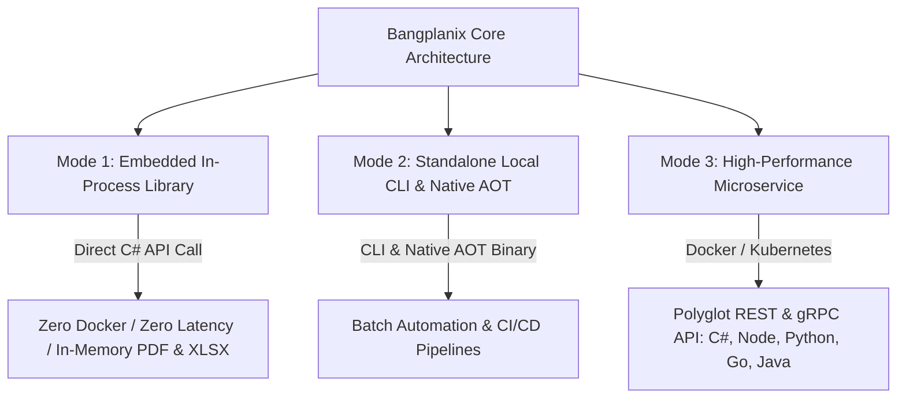

# 📖 Bangplanix Getting Started Guide & Developer Manual

Welcome to the comprehensive **Bangplanix Enterprise Reporting Engine (.NET 10 / C# 14 / Native AOT)** guide. This manual walks you through setup, template design, frontend embedding, polyglot SDK integration, legacy report migration, and production deployment.

> 🌐 **Available Languages:**
> * 🇬🇧 [English (GETTING-STARTED.md)](./GETTING-STARTED.md)
> * 🇹🇭 [ไทย (GETTING-STARTED.th.md)](./GETTING-STARTED.th.md)
> * 🇨🇳 [简体中文 (GETTING-STARTED.zh.md)](./GETTING-STARTED.zh.md)
> * 🇯🇵 [日本語 (GETTING-STARTED.ja.md)](./GETTING-STARTED.ja.md)
> * 🇪🇸 [Español (GETTING-STARTED.es.md)](./GETTING-STARTED.es.md)

---

## 📑 Table of Contents

1. [🚀 Part 1: 3 Execution Modes & Decision Matrix](#-part-1-3-execution-modes--decision-matrix)
2. [📁 Part 2: Global Standard Starter Templates Pack & Designer](#-part-2-global-standard-starter-templates-pack--designer)
3. [🤖 Part 3: Bangplanix AI Suite Natural Language Generation](#-part-3-bangplanix-ai-suite-natural-language-generation)
4. [💾 Part 4: Data Push & SQL Database Binding](#-part-4-data-push--sql-database-binding)
5. [🖥️ Part 5: Embedding Frontend Web Components (React, Vue, Web Components)](#-part-5-embedding-frontend-web-components-react-vue-web-components)
6. [🔌 Part 6: Backend Polyglot Client SDKs & Return Formats (FilePath, Stream, Base64)](#-part-6-backend-polyglot-client-sdks--return-formats-filepath-stream-base64)
7. [🔄 Part 7: Legacy Report Migration (Crystal, SSRS, Jasper, FastReport)](#-part-7-legacy-report-migration-crystal-ssrs-jasper-fastreport)
8. [🚢 Part 8: Production Deployment & License Activation](#-part-8-production-deployment--license-activation)
9. [🛠️ Part 9: Global Typography & Troubleshooting FAQ](#-part-9-global-typography--troubleshooting-faq)

---

## 🚀 Part 1: 3 Execution Modes & Decision Matrix

Bangplanix provides **three distinct execution modes** designed to match your application architecture and developer preferences:



### 📊 Decision Matrix: Which Mode Should You Choose?

| Execution Mode | Ideal Architecture | Best Used When... | Docker Needed? |
| :--- | :--- | :--- | :---: |
| **Mode 1: In-Process Library** | .NET 8 / 9 / 10 Apps (Web API, Worker, MAUI) | You want maximum speed (sub-millisecond Zero-GC), no network hops, and zero external dependencies (Like QuestPDF). | ❌ **No** |
| **Mode 2: Standalone Local CLI** | CI/CD, Shell Scripts, Scheduled Tasks | You want to batch convert reports or generate documents from command line without setting up a server. | ❌ **No** |
| **Mode 3: Microservice / Docker** | Polyglot Stacks (Node, Python, Go, Java, K8s) | You have a distributed architecture and need a centralized reporting engine with REST / gRPC endpoints. | ✅ **Yes** |

---

### 1.1 Mode 1: Embedded In-Process Library (.NET / C# — Like QuestPDF)

If you are developing in C# / .NET, **you do not need Docker or any external server**. Simply add the library packages and render reports directly in memory:

#### Install Packages:
```bash
dotnet add package Bangplanix.Engine
dotnet add package Bangplanix.Core
```

#### In-Process C# Example:
```csharp
using Bangplanix.Core.Parser;
using Bangplanix.Engine.Pdf;
using Bangplanix.Connectors.Json;

// 1. Load your .bpx template schema
string templateJson = await File.ReadAllTextAsync("templates/commercial-invoice-ubl.bpx");
var report = BpxParser.Parse(templateJson);

// 2. Load dataset payload (JSON or Object)
string dataJson = await File.ReadAllTextAsync("data/commercial-invoice-data.json");
var dataRows = JsonPushStreamConnector.ParseJsonStringToRows(dataJson);

// 3. Render Vector PDF in-memory (Zero-GC)
var renderer = new SkiaPdfRenderer();
byte[] pdfBytes = await renderer.RenderToPdfAsync(report, null, dataRows);
await File.WriteAllBytesAsync("output/invoice.pdf", pdfBytes);
```

#### ⚡ 30-Second Copy-Paste Quickstart (ASP.NET Core Minimal API):
```csharp
var builder = WebApplication.CreateBuilder(args);
var app = builder.Build();

app.MapGet("/api/invoice/{id}/pdf", async (int id) =>
{
    var template = BpxParser.Parse(await File.ReadAllTextAsync("invoice.bpx"));
    var pdf = await new SkiaPdfRenderer().RenderToPdfAsync(template);
    return Results.File(pdf, "application/pdf", $"invoice_{id}.pdf");
});

app.Run();
```

---

### 1.2 Mode 2: Standalone Local CLI & Native AOT Binary (Zero Docker)

Use the pre-compiled **Bangplanix CLI** for local scripts, CI/CD pipelines, or batch processing:

#### CLI Commands:
```bash
# Render to Vector PDF
bangplanix render -t templates/commercial-invoice-ubl.bpx -d data.json -o output/invoice.pdf

# Export to Excel (.xlsx)
bangplanix render -t templates/commercial-invoice-ubl.bpx -d data.json -o output/invoice.xlsx -f xlsx

# Validate a .bpx Template Schema
bangplanix validate -t templates/commercial-invoice-ubl.bpx
```

#### Terminal Execution Preview:
```text
=================================================
Bangplanix CLI — High Performance Reporting Engine
=================================================
[1/3] Parsing .bpx template: templates/commercial-invoice-ubl.bpx
[2/3] Loading data payload: data.json
[3/3] Rendering Vector PDF via SkiaSharp Engine...
✓ PDF generated successfully in 21 ms: D:\bangplanix\output\invoice.pdf (42,318 bytes)
```

---

### 1.3 Mode 3: High-Performance Reporting Microservice (Docker & Polyglot SDKs)

Deploy Bangplanix as a centralized containerized service for polyglot backend teams:

#### Start Container with Docker Compose:
```bash
docker compose up -d
```
* **Web Management Portal GUI:** [`http://localhost:9545/portal`](http://localhost:9545/portal) (Default: `admin` / `bangplanix2026!`)
* **High-Speed gRPC Endpoint:** `localhost:9546`
* **REST API Endpoint:** `http://localhost:9545/api/v1/report/render`

#### System Diagnostics (System Doctor):
```bash
dotnet run --project tools/Bangplanix.Cli -- doctor
```

---

## 📁 Part 2: Global Standard Starter Templates Pack & Designer

Bangplanix includes **5 production-ready, international standard templates** in `samples/templates/` that you can immediately adapt:

| Template | Description | File Path |
| :--- | :--- | :--- |
| 🧾 **1. Global Commercial Invoice** | Multi-item commercial tax invoice conforming to UN/CEFACT & UBL 2.1 international trade standards. | `samples/templates/commercial-invoice-ubl.bpx` |
| 📊 **2. Executive Financial KPI Summary** | Monthly executive business summary with performance KPIs, tables, and visualization charts. | `samples/templates/executive-summary.bpx` |
| 💰 **3. Corporate Employee Payslip** | Comprehensive compensation slip detailing basic salary, bonuses, tax deductions, and benefits. | `samples/templates/employee-payslip.bpx` |
| 📦 **4. Shipping Logistics Label (4x6)** | Industrial warehouse shipping label with GS1-128 barcode, QR tracking, and routing indicators. | `samples/templates/shipping-logistics-label-4x6.bpx` |
| 🖨️ **5. POS Retail Thermal Receipt (80mm)** | High-speed thermal receipt for retail and restaurant POS with discounts, tax breakdown, and QR code. | `samples/templates/pos-thermal-receipt-80mm.bpx` |

### Quick Test Commands for Starter Templates:
```bash
# 1. Render Commercial Invoice
bangplanix render -t samples/templates/commercial-invoice-ubl.bpx -d samples/templates/data/commercial-invoice-data.json -o output/invoice.pdf

# 2. Render Employee Payslip
bangplanix render -t samples/templates/employee-payslip.bpx -d samples/templates/data/payslip-data.json -o output/payslip.pdf

# 3. Render Shipping Label
bangplanix render -t samples/templates/shipping-logistics-label-4x6.bpx -d samples/templates/data/shipping-label-data.json -o output/shipping_label.pdf
```

### Visual Drag & Drop Designer (`<bangplanix-designer>`)
Design templates visually without writing raw JSON:
```bash
npm install @bangplanix/designer
```
```html
<bangplanix-designer></bangplanix-designer>
```
* **No-Code Layout:** Drag text, tables, barcodes, and charts directly onto the canvas.
* **Export .bpx:** Click **Export** to download the compiled `.bpx` schema for your C# code or CLI pipelines.

---

## 🤖 Part 3: Bangplanix AI Suite Natural Language Generation

> 💡 *Note: The core AI engine (`ReportAiGenerator`, `HybridLlmGateway`, `AiSqlSafetyValidator`) is available via .NET and JS SDKs. The interactive Visual AI Designer ribbon buttons and chat dialog are in [Roadmap v1.1.0](./ROADMAP.md).*

Generate complex `.bpx` layouts, calculations, and dataset schemas directly from natural language prompts:

### English Example Prompt:
> *"Generate an executive sales report with a monthly summary chart, tabular line items (SKU, Description, Quantity, UnitPrice, LineTotal), and a footer displaying subtotal, 7% VAT, and grand total."*

The AI engine automatically outputs:
1. Valid `.bpx` schema hierarchy (Page Header, Group Bands, Detail, and Page Footer).
2. Compiled Roslyn formulas (`=Sum(Fields.Quantity * Fields.UnitPrice)`).
3. Barcode and EMVCo QR code visuals.

---

## 💾 Part 4: Data Push & SQL Database Binding

### 4.1 Push JSON Data Directly (Decoupled Microservices)
Send JSON payloads over HTTP/gRPC without giving database credentials to the reporting server:

```json
[
  { "ItemCode": "SKU-001", "ItemName": "High-Performance Cloud Compute", "Price": 1500.00 },
  { "ItemCode": "SKU-002", "ItemName": "Enterprise Bangplanix License", "Price": 499.00 }
]
```

### 4.2 SQL Database Queries (PostgreSQL, MSSQL, MySQL)
Configure parameterized queries with encrypted connection strings in `.bpx`:
```json
{
  "datasets": [
    {
      "name": "InvoiceDataset",
      "type": "Sql",
      "connectionRef": "AesEncryptedConnectionToken",
      "queryOrUrl": "SELECT ItemCode, ItemName, Price FROM OrderItems WHERE OrderId = @OrderId"
    }
  ]
}
```

---

## 🖥️ Part 5: Embedding Frontend Web Components (React, Vue, Web Components)

### 5.1 Install Web Viewer Component
```bash
npm install @bangplanix/viewer
```

### 5.2 Plain HTML / JavaScript
```html
<!DOCTYPE html>
<html>
<head>
  <script type="module" src="node_modules/@bangplanix/viewer/dist/viewer.js"></script>
</head>
<body>
  <bangplanix-viewer 
    src="http://localhost:9545/api/v1/reports/render"
    theme="light"
    zoom="fit-width">
  </bangplanix-viewer>
</body>
</html>
```

### 5.3 React & Next.js Integration
```tsx
import React from 'react';
import '@bangplanix/viewer';

export function InvoiceViewer() {
  return (
    <div style={{ width: '100%', height: '100vh' }}>
      <bangplanix-viewer src="/api/reports/invoice.pdf" />
    </div>
  );
}
```

---

## 🔌 Part 6: Backend Polyglot Client SDKs & Return Formats (FilePath, Stream, Base64)

All official SDKs support **3 unified return formats** (Saving to FilePath, In-Memory Streams, and Base64 Strings) for frictionless integration with Web APIs, cloud storage, and frontends:

<details open>
<summary><b>🔷 1. C# / .NET SDK (.NET 8 / 9 / 10)</b></summary>

```bash
dotnet add package Bangplanix.Client
```
```csharp
using Bangplanix.Client;

var client = new BangplanixClient("http://localhost:9545");
var request = new RenderClientRequest { TemplatePath = "templates/commercial-invoice-ubl.bpx", DataJson = jsonData };

// 1. Direct File Output (FilePath)
await client.RenderToFileAsync(request, "output/invoice.pdf");

// 2. In-Memory Stream Output (Stream)
var result = await client.RenderReportAsync(request);
using MemoryStream stream = result.ToStream();

// 3. Base64 String Output (Base64)
string base64String = result.ToBase64();
```
</details>

<details>
<summary><b>🟢 2. Node.js / TypeScript SDK</b></summary>

```bash
npm install @bangplanix/client
```
```typescript
import { BangplanixClient } from '@bangplanix/client';

const client = new BangplanixClient({ serverUrl: 'http://localhost:9545' });
const request = { templatePath: 'templates/commercial-invoice-ubl.bpx', data: orderItems };

// 1. Direct File Output (FilePath)
await client.renderToFile(request, 'output/invoice.pdf');

// 2. In-Memory Stream Output (Stream)
const stream = await client.renderToStream(request);

// 3. Base64 String Output (Base64)
const { base64 } = await client.renderToBase64(request);
```
</details>

<details>
<summary><b>🐍 3. Python SDK</b></summary>

```bash
pip install bangplanix
```
```python
from bangplanix import BangplanixClient, RenderRequest

client = BangplanixClient(server_url="http://localhost:9545")
req = RenderRequest(template_path="templates/commercial-invoice-ubl.bpx", data=order_items)

# 1. Direct File Output (FilePath)
client.render_to_file(req, "output/invoice.pdf")

# 2. In-Memory Stream Output (Stream)
res = client.render_report(req)
stream = res.to_stream() # io.BytesIO

# 3. Base64 String Output (Base64)
base64_str = res.to_base64()
```
</details>

<details>
<summary><b>🔵 4. Go SDK</b></summary>

```bash
go get github.com/thabot/bangplanix/sdk/go
```
```go
package main

import (
    "context"
    bangplanix "github.com/thabot/bangplanix/sdk/go"
)

func main() {
    client := bangplanix.NewClient("http://localhost:9545")
    req := bangplanix.RenderRequest{TemplatePath: "templates/commercial-invoice-ubl.bpx", DataJSON: jsonData}

    // 1. Direct File Output (FilePath)
    client.RenderToFile(context.Background(), req, "output/invoice.pdf")

    // 2. In-Memory Stream Output (Stream)
    res, _ := client.RenderReport(context.Background(), req)
    reader := res.ToReader() // io.Reader

    // 3. Base64 String Output (Base64)
    base64Str := res.ToBase64()
}
```
</details>

<details>
<summary><b>☕ 5. Java SDK</b></summary>

```java
BangplanixClient client = new BangplanixClient("http://localhost:9545");
RenderRequest req = new RenderRequest("templates/commercial-invoice-ubl.bpx", jsonData);

// 1. Direct File Output (FilePath)
client.renderToFile(req, "output/invoice.pdf");

// 2. In-Memory Stream Output (Stream)
RenderResponse res = client.renderReport(req);
InputStream stream = res.toInputStream();

// 3. Base64 String Output (Base64)
String base64 = res.toBase64();
```
</details>

<details>
<summary><b>🐘 6. PHP (REST API Integration — Standalone Composer Package in Roadmap v1.2.0)</b></summary>

```php
<?php
$payload = [
    'templatePath' => 'templates/invoice.bpx',
    'format' => 'Pdf',
    'dataJson' => json_encode([['ItemName' => 'Service Fee', 'Price' => 5000]])
];

$ch = curl_init('http://localhost:9545/api/v1/reports/render');
curl_setopt($ch, CURLOPT_RETURNTRANSFER, true);
curl_setopt($ch, CURLOPT_POST, true);
curl_setopt($ch, CURLOPT_HTTPHEADER, ['Content-Type: application/json']);
curl_setopt($ch, CURLOPT_POSTFIELDS, json_encode($payload));

$pdf = curl_exec($ch);
curl_close($ch);

file_put_contents('invoice.pdf', $pdf);
?>
```
</details>

<details>
<summary><b>🎯 7. Dart / Flutter (REST API Integration — Standalone pub.dev Package in Roadmap v1.2.0)</b></summary>

```dart
import 'dart:convert';
import 'dart:io';
import 'package:http/http.dart' as http;

Future<void> generateInvoicePdf() async {
  final url = Uri.parse('http://localhost:9545/api/v1/reports/render');
  final response = await http.post(
    url,
    headers: {'Content-Type': 'application/json'},
    body: jsonEncode({
      'templatePath': 'templates/invoice.bpx',
      'format': 'Pdf',
      'dataJson': jsonEncode([
        {'ItemName': 'Mobile POS Terminal', 'Price': 8900}
      ])
    }),
  );

  if (response.statusCode == 200) {
    final file = File('invoice.pdf');
    await file.writeAsBytes(response.bodyBytes);
  }
}
```
</details>

<details>
<summary><b>🦀 8. Rust (reqwest Async REST Integration — Standalone Crate in Roadmap v1.2.0)</b></summary>

```rust
use reqwest::Client;
use serde_json::json;

#[tokio::main]
async fn main() -> Result<(), Box<dyn std::error::Error>> {
    let client = Client::new();
    let res = client.post("http://localhost:9545/api/v1/reports/render")
        .json(&json!({
            "templatePath": "templates/invoice.bpx",
            "format": "Pdf",
            "dataJson": "[{\"ItemName\":\"High-Speed Compute\",\"Price\":9900}]"
        }))
        .send().await?.bytes().await?;

    std::fs::write("invoice.pdf", res)?;
    Ok(())
}
```
</details>

<details>
<summary><b>💎 9. Ruby (Net::HTTP REST Integration — Standalone Gem in Roadmap v1.2.0)</b></summary>

```ruby
require 'net/http'
require 'uri'
require 'json'

uri = URI.parse("http://localhost:9545/api/v1/reports/render")
payload = {
  templatePath: "templates/invoice.bpx",
  format: "Pdf",
  dataJson: [{ ItemName: "SaaS Monthly Subscription", Price: 1200 }].to_json
}

response = Net::HTTP.post(uri, payload.to_json, { 'Content-Type' => 'application/json' })
File.open("invoice.pdf", "wb") { |f| f.write(response.body) }
```
</details>

<details>
<summary><b>⚡ 10. cURL / Shell Script / Command Line</b></summary>

```bash
curl -X POST http://localhost:9545/api/v1/reports/render \
  -H "Content-Type: application/json" \
  -d '{
    "templatePath": "templates/invoice.bpx",
    "format": "Pdf",
    "dataJson": "[{\"ItemName\":\"Cloud Compute Node\",\"Price\":15000}]"
  }' \
  --output invoice.pdf
```
</details>

---

## 🔄 Part 7: Legacy Report Migration (Crystal, SSRS, Jasper, FastReport)

Convert legacy enterprise reports to `.bpx` with the built-in CLI migration utility:

```bash
# Convert single file (SSRS RDL -> BPX)
dotnet run --project tools/Bangplanix.Cli -- migrate -i ./legacy/Invoice.rdl -o ./templates/Invoice.bpx

# Batch migrate entire directory (Crystal XML -> BPX)
dotnet run --project tools/Bangplanix.Cli -- migrate -i ./crystal_reports/ -o ./bpx_templates/
```

### Supported Legacy Formats:
| Legacy System | Extension |
| :--- | :--- |
| **Microsoft SSRS / Power BI** | `.rdl`, `.rdlc` |
| **SAP Crystal Reports** | `.rpt.xml`, `.xml` |
| **SAP Adobe Document Services (ADS) / XFA** | `.xdp`, `.xfa.xml` |
| **BarTender Label Designer** | `.btw`, `.btw.xml`, `.btw.json` |
| **Microsoft Access Database Reports** | `.accdb`, `.mdb`, `.access.txt`, `.access.xml` |
| **TIBCO Jaspersoft** | `.jrxml` |
| **FastReport** | `.frx` |
| **Stimulsoft Reports** | `.mrt` (JSON / XML) |
| **Progress Telerik** | `.trdx`, `.trdp` |
| **DevExpress XtraReports** | `.repx` |
| **Eclipse BIRT** | `.rptdesign`, `.birt.xml` |
| **GrapeCity ActiveReports** | `.rdlx`, `.rpx` |
| **Hitachi Vantara Pentaho** | `.prpt`, `.prpt.xml` |
| **Oracle BI Publisher** | `.xdo`, `.bip.xml`, `.rtf` |
| **IBM Cognos Analytics** | `.spec`, `.cognos.xml` |
| **Handlebars & Mustache** | `.hbs`, `.mustache` |
| **OASIS UBL 2.1 E-Invoicing** | `.ubl`, `.xml` |
| **Zebra ZPL / EPL** | `.zpl`, `.epl` |
| **Epson ESC/POS POS Receipts** | `.escpos`, `.pos` |
| **Office & HTML Templates** | `.docx`, `.xlsx`, `.html`, `.liquid` |

---

## 🚢 Part 8: Production Deployment & License Activation

### 8.1 License Key Activation (Air-Gapped Offline)
Set your cryptographically signed license token via environment variables:

```bash
export LICENSE_KEY="eyJsaWNlbnNlSWQiOiJMSUMtMTAwMS...<token>"
```
* Automatically unwatermarks generated PDF documents.
* Unlocks unlimited CPU core execution and enterprise features (AI Suite, Report Bursting, PAdES Signatures *(Production CA/TSA & Cloud Drivers in [Roadmap v1.1.0](./ROADMAP.md))*).

### 8.2 Kubernetes Helm Chart Deployment
```bash
helm upgrade --install bangplanix ./deploy/helm/bangplanix \
  --namespace reporting --create-namespace \
  --set replicaCount=3 \
  --set autoscaling.enabled=true \
  --set licenseKey="eyJ..."
```

---

## 🛠️ Part 9: Global Typography & Troubleshooting FAQ

### 9.1 Multi-Language Typography & Complex Text Shaping
* **HarfBuzz Integration:** Bangplanix integrates **HarfBuzzSharp** to automatically shape complex scripts (Thai floating tone marks/vowels, Arabic right-to-left cursive, Devanagari ligatures, and East Asian CJK characters) without glyph clipping.
* **Custom Font Loading:** Map your TTF/OTF fonts to `/app/volumes/fonts` or pass custom font paths in the CLI with `--font-dir`.

### 9.2 Troubleshooting & FAQ

#### Q: How do I resolve missing fonts or square tofu characters in Docker/Linux?
**A:** Mount standard TrueType fonts into the container using the volume flag:
```bash
docker run -v $(pwd)/volumes/fonts:/app/volumes/fonts ...
```
Bangplanix scans this directory recursively upon startup and caches font tables for instant sub-millisecond lookups.

#### Q: Why is Excel (.xlsx) export faster than PDF?
**A:** Excel export utilizes **MiniExcel** zero-allocation streaming, directly constructing OpenXML ZIP packages with minimal memory footprint, whereas PDF performs high-precision vector canvas operations and text shaping.

#### Q: Can I print directly to POS slip printers without generating a PDF?
**A:** Yes! Use the CLI `print` command with `--printer-type escpos` or `--printer-type zpl` to send raw byte sequences directly to network thermal printers on port 9100 or via CUPS/IPP.

---

## 💬 Community & Support

* 🐞 **Issues & Bugs:** [GitHub Issues](https://github.com/thabot/bangplanix/issues)
* 💡 **Discussions:** [GitHub Discussions](https://github.com/thabot/bangplanix/discussions)
* 💼 **Commercial & OEM Inquiries:** `thabot47@gmail.com`
