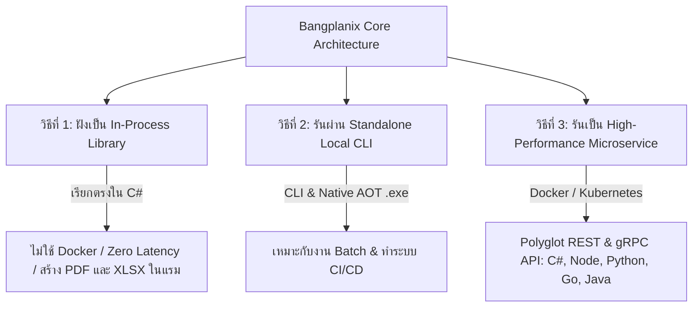

# 📖 คู่มือการใช้งาน Bangplanix (Getting Started Guide)

ยินดีต้อนรับสู่คู่มือการเริ่มต้นใช้งาน **Bangplanix Enterprise Reporting Engine (.NET 10 / C# 14 / Native AOT)** ตั้งแต่เริ่มต้นติดตั้ง ออกแบบเทมเพลต ไปจนถึงการนำขึ้นใช้งานจริงบนระบบ Production

> 🌐 **ภาษาอื่นๆ / Available Languages:**
> * 🇬🇧 [English (GETTING-STARTED.md)](./GETTING-STARTED.md)
> * 🇹🇭 [ไทย (GETTING-STARTED.th.md)](./GETTING-STARTED.th.md)
> * 🇨🇳 [简体中文 (GETTING-STARTED.zh.md)](./GETTING-STARTED.zh.md)
> * 🇯🇵 [日本語 (GETTING-STARTED.ja.md)](./GETTING-STARTED.ja.md)
> * 🇪🇸 [Español (GETTING-STARTED.es.md)](./GETTING-STARTED.es.md)

---

## 📑 สารบัญ (Table of Contents)

1. [🚀 บทที่ 1: 3 รูปแบบการรันและการแปลงรายงาน (3 Execution Modes)](#-บทที่-1-3-รูปแบบการรันและการแปลงรายงาน-3-execution-modes)
2. [📁 บทที่ 2: คลังเทมเพลตมาตรฐานสากล (Global Starter Templates Pack) & Designer](#-บทที่-2-คลังเทมเพลตมาตรฐานสากล-global-starter-templates-pack--designer)
3. [🤖 บทที่ 3: การใช้ AI Suite สั่งสร้างรายงานด้วยภาษาพูด](#-บทที่-3-การใช้-ai-suite-สั่งสร้างรายงานด้วยภาษาพูด)
4. [💾 บทที่ 4: การป้อนข้อมูล (JSON Data Push & SQL Databases)](#-บทที่-4-การป้อนข้อมูล-json-data-push--sql-databases)
5. [🖥️ บทที่ 5: การนำไปฝังในหน้าเว็บ Frontend (React, Vue, Web Components)](#-บทที่-5-การนำไปฝังในหน้าเว็บ-frontend-react-vue-web-components)
6. [🔌 บทที่ 6: การเรียกใช้งานผ่าน Backend SDKs & รูปแบบผลลัพธ์ (FilePath, Stream, Base64)](#-บทที่-6-การเรียกใช้งานผ่าน-backend-sdks--รูปแบบผลลัพธ์-filepath-stream-base64)
7. [🔄 บทที่ 7: การแปลงรายงานเดิม (Crystal, SSRS, Jasper, FastReport)](#-บทที่-7-การแปลงรายงานเดิม-crystal-ssrs-jasper-fastreport)
8. [🚢 บทที่ 8: การนำขึ้นใช้งานบน Production & License Activation](#-บทที่-8-การนำขึ้นใช้งานบน-production--license-activation)
9. [🛠️ บทที่ 9: การจัดการฟอนต์ภาษาไทยและคำถามที่พบบ่อย (Troubleshooting FAQ)](#-บทที่-9-การจัดการฟอนต์ภาษาไทยและคำถามที่พบบ่อย-troubleshooting-faq)

---

## 🚀 บทที่ 1: 3 รูปแบบการรันและการแปลงรายงาน (3 Execution Modes)

Bangplanix มอบความยืดหยุ่นสูงสุดด้วย **3 รูปแบบการรัน** ที่ตอบโจทย์ทุกสถาปัตยกรรมระบบ:



### 📊 ตารางเปรียบเทียบ: ควรเลือกใช้โหมดไหน? (Decision Matrix)

| รูปแบบการรัน | สถาปัตยกรรมที่เหมาะสม | ใช้เมื่อไหร่ดี? | ต้องลง Docker ไหม? |
| :--- | :--- | :--- | :---: |
| **วิธีที่ 1: In-Process Library** | .NET 8 / 9 / 10 Apps (Web API, Worker, MAUI) | ต้องการความเร็วสูงสุดระดับไมโครวินาที (Zero-GC) ไม่ต้องการ Latency เครือข่าย และไม่อยากจัดการเซิร์ฟเวอร์ (เหมือน QuestPDF) | ❌ **ไม่ต้อง** |
| **วิธีที่ 2: Standalone Local CLI** | CI/CD, Shell Scripts, Batch Jobs | ต้องการสั่งแปลงรายงานเป็นชุด หรือรันคำสั่ง Command Line บนเซิร์ฟเวอร์โดยไม่ต้องเปิด Service ค้างไว้ | ❌ **ไม่ต้อง** |
| **วิธีที่ 3: Microservice / Docker** | Polyglot Stacks (Node, Python, Go, Java, K8s) | สถาปัตยกรรมแบบกระจายศูนย์ (Distributed) ที่ต้องการเซิร์ฟเวอร์รายงานส่วนกลางพร้อม gRPC / REST API | ✅ **ใช้** |

---

### 1.1 วิธีที่ 1: ฝังเป็น In-Process Library ในโค้ด C# / .NET (แบบ QuestPDF ไม่ต้องใช้ Docker)

หากคุณพัฒนาแอปพลิเคชันด้วย C# / .NET **คุณไม่จำเป็นต้องเปิด Docker หรือเซิร์ฟเวอร์ใดๆ เลย** สามารถอ้างอิง Library เข้าโปรเจกต์และเรนเดอร์เอกสารในหน่วยความจำได้ทันที:

#### ติดตั้ง Package:
```bash
dotnet add package Bangplanix.Engine
dotnet add package Bangplanix.Core
```

#### ตัวอย่างโค้ด C# (In-Process):
```csharp
using Bangplanix.Core.Parser;
using Bangplanix.Engine.Pdf;
using Bangplanix.Connectors.Json;

// 1. อ่าน Schema เทมเพลต .bpx
string templateJson = await File.ReadAllTextAsync("templates/commercial-invoice-ubl.bpx");
var report = BpxParser.Parse(templateJson);

// 2. อ่านข้อมูล Dataset JSON
string dataJson = await File.ReadAllTextAsync("data/commercial-invoice-data.json");
var dataRows = JsonPushStreamConnector.ParseJsonStringToRows(dataJson);

// 3. เรนเดอร์เป็น Vector PDF ในหน่วยความจำโดยตรง
var renderer = new SkiaPdfRenderer();
byte[] pdfBytes = await renderer.RenderToPdfAsync(report, null, dataRows);
await File.WriteAllBytesAsync("output/invoice.pdf", pdfBytes);
```

#### ⚡ 30-Second Copy-Paste Quickstart (ASP.NET Core Minimal API):
```csharp
var builder = WebApplication.CreateBuilder(args);
var app = builder.Build();

app.MapGet("/api/invoice/{id}/pdf", async (int id) =>
{
    var template = BpxParser.Parse(await File.ReadAllTextAsync("invoice.bpx"));
    var pdf = await new SkiaPdfRenderer().RenderToPdfAsync(template);
    return Results.File(pdf, "application/pdf", $"invoice_{id}.pdf");
});

app.Run();
```

---

### 1.2 วิธีที่ 2: รันผ่าน Standalone Local CLI หรือ Native AOT Binary (ไม่ต้องลง Docker)

สำหรับการทำงานแบบ Batch Automation, CI/CD Pipeline หรือใช้งานบน Desktop สามารถใช้ **Bangplanix CLI** หรือไฟล์ Native AOT executable:

#### ตัวอย่างคำสั่ง CLI:
```bash
# สั่งเรนเดอร์เป็น PDF
bangplanix render -t templates/commercial-invoice-ubl.bpx -d data.json -o output/invoice.pdf

# สั่งส่งออกเป็น Excel (.xlsx)
bangplanix render -t templates/commercial-invoice-ubl.bpx -d data.json -o output/invoice.xlsx -f xlsx

# ตรวจสอบความถูกต้องของเทมเพลต .bpx
bangplanix validate -t templates/commercial-invoice-ubl.bpx
```

#### ตัวอย่างหน้าจอผลลัพธ์ (Terminal Preview):
```text
=================================================
Bangplanix CLI — High Performance Reporting Engine
=================================================
[1/3] Parsing .bpx template: templates/commercial-invoice-ubl.bpx
[2/3] Loading data payload: data.json
[3/3] Rendering Vector PDF via SkiaSharp Engine...
✓ PDF generated successfully in 21 ms: D:\bangplanix\output\invoice.pdf (42,318 bytes)
```

---

### 1.3 วิธีที่ 3: รันเป็น High-Performance Reporting Microservice (Docker & Polyglot SDKs)

สำหรับระบบที่เขียนด้วยหลายภาษา (**Node.js, Python, Go, Java, C#**) สามารถรันเป็น Reporting Service รวมศูนย์ผ่าน Docker Compose:

#### เริ่มรัน Container:
```bash
docker compose up -d
```
* **🚀 Web Management Portal GUI:** [`http://localhost:9545/portal`](http://localhost:9545/portal) (เข้าสู่ระบบด้วย: `admin` / `bangplanix2026!`)
* **High-Speed gRPC Endpoint:** `localhost:9546`
* **REST API Endpoint:** `http://localhost:9545/api/v1/report/render`

#### ตรวจสอบความพร้อมของระบบ (System Doctor):
```bash
dotnet run --project tools/Bangplanix.Cli -- doctor
```

---

## 📁 บทที่ 2: คลังเทมเพลตมาตรฐานสากล (Global Starter Templates Pack) & Designer

Bangplanix มาพร้อม **5 เทมเพลตมาตรฐานสากลระดับโลก** ในโฟลเดอร์ `samples/templates/` ที่พร้อมนำไปปรับแต่งใช้งานได้ทันที:

| เทมเพลต | รายละเอียด | ไฟล์เทมเพลต |
| :--- | :--- | :--- |
| 🧾 **1. Global Commercial Invoice** | ใบแจ้งหนี้การค้ามาตรฐานสากล UN/CEFACT & UBL 2.1 พร้อมตารางรายการสินค้าและคำนวณภาษี | `samples/templates/commercial-invoice-ubl.bpx` |
| 📊 **2. Executive Financial KPI Summary** | รายงานสรุปผลประกอบการและตัวชี้วัดธุรกิจสำหรับผู้บริหาร พร้อมแผนภูมิสรุปยอด | `samples/templates/executive-summary.bpx` |
| 💰 **3. Corporate Employee Payslip** | สลิปเงินเดือนพนักงานองค์กรสากล พร้อมแจกแจงรายได้ โบนัส และภาษีหัก ณ ที่จ่าย | `samples/templates/employee-payslip.bpx` |
| 📦 **4. Shipping Logistics Label (4x6)** | ป้ายติดพัสดุและบาร์โค้ดขนส่งมาตรฐาน GS1-128 / QR Code สำหรับงานคลังสินค้า | `samples/templates/shipping-logistics-label-4x6.bpx` |
| 🖨️ **5. POS Retail Thermal Receipt (80mm)** | ใบเสร็จรับเงินเครื่องพิมพ์ความร้อน POS สำหรับธุรกิจค้าปลีกและร้านอาหาร | `samples/templates/pos-thermal-receipt-80mm.bpx` |

### ตัวอย่างคำสั่งทดสอบเรนเดอร์ Starter Templates:
```bash
# 1. ทดสอบเรนเดอร์ Commercial Invoice
bangplanix render -t samples/templates/commercial-invoice-ubl.bpx -d samples/templates/data/commercial-invoice-data.json -o output/invoice.pdf

# 2. ทดสอบเรนเดอร์ Employee Payslip
bangplanix render -t samples/templates/employee-payslip.bpx -d samples/templates/data/payslip-data.json -o output/payslip.pdf

# 3. ทดสอบเรนเดอร์ Shipping Label
bangplanix render -t samples/templates/shipping-logistics-label-4x6.bpx -d samples/templates/data/shipping-label-data.json -o output/shipping_label.pdf
```

### การออกแบบด้วย Web Visual Designer (`<bangplanix-designer>`)
ออกแบบและปรับแต่งรายงานผ่านหน้าเว็บได้โดยไม่ต้องเขียน JSON:
```bash
npm install @bangplanix/designer
```
```html
<bangplanix-designer></bangplanix-designer>
```
* **No-Code Layout:** ลากวางข้อความ ตาราง บาร์โค้ด และรูปภาพบนผืนผ้าใบได้แบบ WYSIWYG
* **Export .bpx:** กดปุ่ม **Export** เพื่อนำไฟล์ Schema ไปใช้ในโค้ด C# หรือคำสั่ง CLI ได้ทันที
  },
  "bands": {
    "pageHeader": {
      "height": 30,
      "elements": [
        {
          "type": "Text",
          "text": "บริษัท สยามเทคโนโลยี ซิสเต็มส์ จำกัด",
          "x": 0, "y": 0, "width": 190, "height": 10,
          "style": { "fontSize": 14, "fontWeight": "Bold", "color": "#0f172a" }
        }
      ]
    },
    "detail": {
      "height": 8,
      "elements": [
        { "type": "Text", "expression": "=Fields.ItemName", "x": 0, "y": 0, "width": 120, "height": 8 },
        { "type": "Text", "expression": "=Fields.Price", "x": 120, "y": 0, "width": 70, "height": 8, "style": { "align": "Right" } }
      ]
    },
    "pageFooter": {
      "height": 15,
      "elements": [
        {
          "type": "Text",
          "expression": "=\"รวมทั้งสิ้น \" + BahtText(Sum(Fields.Price))",
          "x": 0, "y": 0, "width": 190, "height": 8,
          "style": { "fontSize": 9, "color": "#475569" }
        }
      ]
    }
  }
}
```

### การใช้งาน Visual Designer (`<bangplanix-designer>`)
หากต้องการออกแบบรายงานแบบ Drag & Drop ผ่านหน้าจอเว็บ:
1. ติดตั้ง `@bangplanix/designer`:
   ```bash
   npm install @bangplanix/designer
   ```
2. ฝังลงในหน้าเว็บ:
   ```html
   <bangplanix-designer></bangplanix-designer>
   ```

---

## 🤖 บทที่ 3: การใช้ AI Suite สั่งสร้างรายงานด้วยภาษาพูด

> 💡 *หมายเหตุ: Core AI Engine (`ReportAiGenerator`, `HybridLlmGateway`, `AiSqlSafetyValidator`) สามารถเรียกใช้งานผ่าน C# และ JavaScript SDK ได้ในปัจจุบัน ส่วนปุ่มสั่งการ Visual AI Designer บนหน้าจอ Ribbon และหน้าต่างแชทอยู่ใน [Roadmap v1.1.0](./ROADMAP.md)*

Bangplanix มาพร้อมกับ **Bangplanix AI Suite** ช่วยให้สร้างเทมเพลต `.bpx` ได้จาก Natural Language ทั้งภาษาไทยและภาษาอังกฤษ

### ตัวอย่างการสั่งงานด้วยภาษาไทย:
> *"สร้างใบเสร็จรับเงินสำหรับบริษัทไอที มีรหัสสินค้า ชื่อสินค้า จำนวน ราคา และยอดรวม ด้านล่างใส่ PromptPay QR Code และยอดเงินบาทถ้วน"*

AI จะสร้างโครงสร้าง `.bpx` ที่ประกอบด้วย:
1. **Header:** โลโก้และข้อมูลผู้ขาย
2. **Detail Band:** ตารางสินค้าพร้อม Expression เชื่อมโยงข้อมูล
3. **Footer:** สรุปยอดเงินพร้อมฟังก์ชัน `=BahtText(Sum(Fields.Amount))` และ QR Code EMVCo PromptPay

---

## 💾 บทที่ 4: การป้อนข้อมูล (JSON Data Push & SQL Databases)

### 4.1 ส่งข้อมูล JSON ตรงเข้า Engine (Microservices Pattern)
ไม่จำเป็นต้องต่อ Database ตรงกับ Engine สามารถส่ง JSON Payload เข้ามาทาง API ได้ทันที:

```json
[
  { "ItemCode": "SKU-001", "ItemName": "Cloud Server Subscription", "Price": 15000.00 },
  { "ItemCode": "SKU-002", "ItemName": "Bangplanix Pro License", "Price": 85000.00 }
]
```

### 4.2 เชื่อมต่อกับฐานข้อมูล SQL (SQL Server, PostgreSQL, MySQL)
ระบุ Dataset ในไฟล์ `.bpx`:
```json
{
  "datasets": [
    {
      "name": "InvoiceData",
      "type": "Sql",
      "connectionRef": "EncryptedConnectionStringHere",
      "queryOrUrl": "SELECT ItemCode, ItemName, Price FROM Invoices WHERE CustomerId = @CustomerId"
    }
  ]
}
```

---

## 🖥️ บทที่ 5: การนำไปฝังในหน้าเว็บ Frontend (React, Vue, Web Components)

### 5.1 ติดตั้ง Web Viewer Component
```bash
npm install @bangplanix/viewer
```

### 5.2 ใช้งานใน HTML / Vanilla JS
```html
<!DOCTYPE html>
<html>
<head>
  <script type="module" src="node_modules/@bangplanix/viewer/dist/viewer.js"></script>
</head>
<body>
  <!-- แปะหน้าจอ Preview รายงาน -->
  <bangplanix-viewer 
    src="http://localhost:9545/api/v1/reports/render"
    theme="light"
    zoom="fit-width">
  </bangplanix-viewer>
</body>
</html>
```

### 5.3 ใช้งานใน React (Next.js / Vite)
```tsx
import React, { useEffect, useRef } from 'react';
import '@bangplanix/viewer';

export function ReportViewerPage({ reportData }) {
  const viewerRef = useRef(null);

  useEffect(() => {
    if (viewerRef.current) {
      // ส่ง Dynamic Parameters หรือ Dataset เข้า Viewer ได้โดยตรง
      viewerRef.current.parameters = { CustomerId: 1001 };
      viewerRef.current.reportData = reportData;
    }
  }, [reportData]);

  return (
    <div style={{ width: '100%', height: '100vh' }}>
      <bangplanix-viewer 
        ref={viewerRef}
        src="http://localhost:9545/api/v1/render/pdf"
        theme="light"
      />
    </div>
  );
}
```

### 5.4 ใช้งานใน Vue.js (Vue 3 / Nuxt)
```vue
<template>
  <div class="viewer-container">
    <bangplanix-viewer 
      ref="viewer" 
      src="http://localhost:9545/api/v1/render/pdf" 
      theme="dark" 
      zoom="fit-page"
    />
  </div>
</template>

<script setup>
import { onMounted, ref } from 'vue';
import '@bangplanix/viewer';

const viewer = ref(null);

onMounted(() => {
  if (viewer.value) {
    viewer.value.parameters = { InvoiceNo: "INV-2026-001" };
  }
});
</script>

<style scoped>
.viewer-container { width: 100%; height: 90vh; }
</style>
```

---

## 🔌 บทที่ 6: การเรียกใช้งานผ่าน Backend SDKs และภาษาต่างๆ

Bangplanix มี Official Client SDKs 5 ภาษาหลักแบบ Strongly-typed (C# .NET, Node.js/TypeScript, Python, Go, และ Java) และรองรับการเชื่อมต่อผ่าน HTTP/REST หรือ gRPC API สำหรับภาษาอื่นๆ (ส่วน Standalone Client SDK Packages สำหรับ PHP, Dart/Flutter, Rust, Ruby อยู่ใน [Roadmap v1.2.0](./ROADMAP.md)):

<details open>
<summary><b>🔷 1. C# / .NET SDK (.NET 8 / 9 / 10)</b></summary>

```bash
dotnet add package Bangplanix.Client
```
```csharp
using Bangplanix.Client;

var client = new BangplanixClient("http://localhost:9545");
var request = new RenderReportRequest
{
    TemplatePath = "templates/commercial-invoice-ubl.bpx",
    DataJson = JsonSerializer.Serialize(myDataset)
};

// 1. บันทึกไฟล์ลงดิสก์โดยตรง (FilePath)
await client.RenderToFileAsync(request, "output/invoice.pdf");

// 2. รับผลลัพธ์เป็น In-Memory Stream (Stream)
var result = await client.RenderReportAsync(request);
using Stream stream = result.ToStream();

// 3. รับผลลัพธ์เป็น Base64 String (Base64)
string base64String = result.ToBase64();
```
</details>

<details>
<summary><b>🟢 2. Node.js / TypeScript SDK</b></summary>

```bash
npm install @bangplanix/client
```
```typescript
import { BangplanixClient } from '@bangplanix/client';
import * as fs from 'fs';

const client = new BangplanixClient({ baseUrl: 'http://localhost:9545' });
const req = {
  templatePath: 'templates/commercial-invoice-ubl.bpx',
  data: [{ ItemName: 'High-Performance Cloud Server', Price: 35000 }]
};

// 1. บันทึกไฟล์ลงดิสก์โดยตรง (FilePath)
await client.renderToFile(req, 'output/invoice.pdf');

// 2. รับผลลัพธ์เป็น Readable Stream (Stream)
const stream = await client.renderToStream(req);

// 3. รับผลลัพธ์เป็น Base64 String (Base64)
const base64Str = await client.renderToBase64(req);
```
</details>

<details>
<summary><b>🐍 3. Python SDK</b></summary>

```bash
pip install bangplanix
```
```python
from bangplanix import BangplanixClient

client = BangplanixClient(base_url="http://localhost:9545")
payload = {
    "template_path": "templates/commercial-invoice-ubl.bpx",
    "data": [{"ItemName": "Enterprise Cloud Node", "Price": 8500}]
}

# 1. บันทึกไฟล์ลงดิสก์โดยตรง (FilePath)
client.render_to_file(**payload, output_path="output/invoice.pdf")

# 2. รับผลลัพธ์เป็น In-Memory Binary Stream (Stream)
stream = client.render_to_stream(**payload)

# 3. รับผลลัพธ์เป็น Base64 String (Base64)
base64_str = client.render_to_base64(**payload)
```
</details>

<details>
<summary><b>🔵 4. Go SDK</b></summary>

```bash
go get github.com/thabot/bangplanix/sdk/go
```
```go
package main

import (
    "context"
    "os"
    bangplanix "github.com/thabot/bangplanix/sdk/go"
)

func main() {
    client := bangplanix.NewClient("http://localhost:9545")
    req := &bangplanix.RenderRequest{
        TemplatePath: "templates/commercial-invoice-ubl.bpx",
        DataJson:     `[{"ItemName": "Mechanical Keyboard", "Price": 2500}]`,
    }

    // 1. บันทึกไฟล์ลงดิสก์โดยตรง (FilePath)
    _ = client.RenderToFile(context.Background(), req, "output/invoice.pdf")

    // 2. รับผลลัพธ์เป็น In-Memory Reader Stream (Stream)
    reader, _ := client.RenderToReader(context.Background(), req)

    // 3. รับผลลัพธ์เป็น Base64 String (Base64)
    base64Str, _ := client.RenderToBase64(context.Background(), req)
}
```
</details>

<details>
<summary><b>☕ 5. Java SDK</b></summary>

```java
BangplanixClient client = new BangplanixClient("http://localhost:9545");
RenderRequest req = new RenderRequest("templates/commercial-invoice-ubl.bpx", jsonData);

// 1. บันทึกไฟล์ลงดิสก์โดยตรง (FilePath)
client.renderToFile(req, "output/invoice.pdf");

// 2. รับผลลัพธ์เป็น In-Memory Stream (Stream)
RenderResponse res = client.renderReport(req);
InputStream stream = res.toInputStream();

// 3. รับผลลัพธ์เป็น Base64 String (Base64)
String base64 = res.toBase64();
```
</details>

<details>
<summary><b>🐘 6. PHP (เชื่อมต่อผ่าน REST API — Standalone Composer Package อยู่ใน Roadmap v1.2.0)</b></summary>

```php
<?php
$payload = [
    'templatePath' => 'templates/commercial-invoice-ubl.bpx',
    'format' => 'Pdf',
    'dataJson' => json_encode([['ItemName' => 'Service Fee', 'Price' => 5000]])
];

$ch = curl_init('http://localhost:9545/api/v1/reports/render');
curl_setopt($ch, CURLOPT_RETURNTRANSFER, true);
curl_setopt($ch, CURLOPT_POST, true);
curl_setopt($ch, CURLOPT_HTTPHEADER, ['Content-Type: application/json']);
curl_setopt($ch, CURLOPT_POSTFIELDS, json_encode($payload));

$pdf = curl_exec($ch);
curl_close($ch);

file_put_contents('invoice.pdf', $pdf);
?>
```
</details>

<details>
<summary><b>🎯 7. Dart / Flutter (เชื่อมต่อผ่าน REST API — Standalone pub.dev Package อยู่ใน Roadmap v1.2.0)</b></summary>

```dart
import 'dart:convert';
import 'dart:io';
import 'package:http/http.dart' as http;

Future<void> generateInvoicePdf() async {
  final url = Uri.parse('http://localhost:9545/api/v1/reports/render');
  final response = await http.post(
    url,
    headers: {'Content-Type': 'application/json'},
    body: jsonEncode({
      'templatePath': 'templates/commercial-invoice-ubl.bpx',
      'format': 'Pdf',
      'dataJson': jsonEncode([
        {'ItemName': 'Mobile POS Terminal', 'Price': 8900}
      ])
    }),
  );

  if (response.statusCode == 200) {
    final file = File('invoice.pdf');
    await file.writeAsBytes(response.bodyBytes);
  }
}
```
</details>

<details>
<summary><b>🦀 8. Rust (เชื่อมต่อผ่าน reqwest Async REST API — Standalone Crate อยู่ใน Roadmap v1.2.0)</b></summary>

```rust
use reqwest::Client;
use serde_json::json;

#[tokio::main]
async fn main() -> Result<(), Box<dyn std::error::Error>> {
    let client = Client::new();
    let res = client.post("http://localhost:9545/api/v1/reports/render")
        .json(&json!({
            "templatePath": "templates/commercial-invoice-ubl.bpx",
            "format": "Pdf",
            "dataJson": "[{\"ItemName\":\"High-Speed Compute\",\"Price\":9900}]"
        }))
        .send().await?.bytes().await?;

    std::fs::write("invoice.pdf", res)?;
    Ok(())
}
```
</details>

<details>
<summary><b>💎 9. Ruby (เชื่อมต่อผ่าน Net::HTTP REST API — Standalone Gem อยู่ใน Roadmap v1.2.0)</b></summary>

```ruby
require 'net/http'
require 'uri'
require 'json'

uri = URI.parse("http://localhost:9545/api/v1/reports/render")
payload = {
  templatePath: "templates/commercial-invoice-ubl.bpx",
  format: "Pdf",
  dataJson: [{ ItemName: "SaaS Monthly Subscription", Price: 1200 }].to_json
}

response = Net::HTTP.post(uri, payload.to_json, { 'Content-Type' => 'application/json' })
File.open("invoice.pdf", "wb") { |f| f.write(response.body) }
```
</details>

<details>
<summary><b>⚡ 10. cURL / Shell Script / Command Line</b></summary>

```bash
curl -X POST http://localhost:9545/api/v1/reports/render \
  -H "Content-Type: application/json" \
  -d '{
    "templatePath": "templates/commercial-invoice-ubl.bpx",
    "format": "Pdf",
    "dataJson": "[{\"ItemName\":\"Cloud Compute Node\",\"Price\":15000}]"
  }' \
  --output invoice.pdf
```
</details>

---

## 🔄 บทที่ 7: การแปลงรายงานเดิม (Crystal, SSRS, Jasper, FastReport)

### 7.1 แปลงผ่าน Web Management Portal GUI (ง่ายที่สุด - ลากวางบนเว็บ)
1. เปิด Browser เข้าไปที่ **[`http://localhost:9545/portal`](http://localhost:9545/portal)** แล้วเลือกแท็บ **"🔄 Report Converter"**
2. ลากไฟล์รายงานเดิม (เช่น `Invoice.rdl`, `Sales.jrxml`, `Receipt.frx`, `Catalog.rpt.xml`) วางลงในช่อง Drag & Drop
3. ระบบจะแปลงเป็นโครงสร้าง `.bpx` ทันที พร้อมแสดงพรีวิว JSON สวยงาม
4. กด **"💾 Download .bpx"** หรือกด **"📁 Save to Container Templates"** เพื่อบันทึกลงโฟลเดอร์ `/app/volumes/templates` ของ Container ได้ทันที

### 7.2 แปลงผ่าน REST Converter API (`POST /api/v1/convert`)
สามารถส่งไฟล์ผ่าน HTTP Multipart หรือ Text Payload เพื่อให้ Engine แปลงเป็น `.bpx` ได้โดยตรง:

```bash
# ส่งไฟล์ SSRS RDL ผ่าน cURL
curl -X POST http://localhost:9545/api/v1/convert \
  -F "file=@./legacy/Invoice.rdl" \
  -o ./templates/Invoice.bpx
```

```javascript
// ส่งแปลงผ่าน JavaScript fetch ในหน้าเว็บ
const formData = new FormData();
formData.append('file', myRdlFile);

const res = await fetch('http://localhost:9545/api/v1/convert', {
  method: 'POST',
  body: formData
});
const bpxSchema = await res.json();
console.log('Converted BPX:', bpxSchema);
```

### 7.3 แปลงผ่าน CLI Command Line (`thabot migrate`)
หากต้องการแปลงไฟล์ในระดับโฟลเดอร์หรือทำ Batch Pipeline สามารถใช้คำสั่ง **`thabot migrate`**:

```bash
# แปลงไฟล์เดี่ยว (SSRS RDL -> BPX)
dotnet run --project tools/Bangplanix.Cli -- migrate -i ./legacy/Invoice.rdl -o ./templates/Invoice.bpx

# แปลงทั้งโฟลเดอร์ (Batch Migration Crystal Reports XML -> BPX)
dotnet run --project tools/Bangplanix.Cli -- migrate -i ./legacy_crystal/ -o ./migrated_bpx/
```

### ฟอร์แมตเดิมที่รองรับการแปลง:
| Engine เดิม | นามสกุลไฟล์ |
| :--- | :--- |
| **Microsoft SSRS / Power BI** | `.rdl`, `.rdlc` |
| **SAP Crystal Reports** | `.rpt.xml`, `.xml` |
| **SAP Adobe Document Services (ADS) / XFA** | `.xdp`, `.xfa.xml` |
| **BarTender Label Designer** | `.btw`, `.btw.xml`, `.btw.json` |
| **Microsoft Access Database Reports** | `.accdb`, `.mdb`, `.access.txt`, `.access.xml` |
| **TIBCO Jaspersoft** | `.jrxml` |
| **FastReport** | `.frx` |
| **Stimulsoft Reports** | `.mrt` (JSON / XML) |
| **Progress Telerik** | `.trdx`, `.trdp` |
| **DevExpress XtraReports** | `.repx` |
| **Eclipse BIRT** | `.rptdesign`, `.birt.xml` |
| **GrapeCity ActiveReports** | `.rdlx`, `.rpx` |
| **Hitachi Vantara Pentaho** | `.prpt`, `.prpt.xml` |
| **Oracle BI Publisher** | `.xdo`, `.bip.xml`, `.rtf` |
| **IBM Cognos Analytics** | `.spec`, `.cognos.xml` |
| **Handlebars & Mustache** | `.hbs`, `.mustache` |
| **OASIS UBL 2.1 E-Invoicing** | `.ubl`, `.xml` |
| **Zebra ZPL / EPL** | `.zpl`, `.epl` |
| **Epson ESC/POS POS Receipts** | `.escpos`, `.pos` |
| **Office & Web Templates** | `.docx`, `.xlsx`, `.html`, `.liquid` |

---

## 🚢 บทที่ 8: การนำขึ้นใช้งานบน Production & License Activation

### 8.1 การเปิดใช้งาน License Key (Air-Gapped Offline)
เมื่อได้รับ Commercial License Token จากการสั่งซื้อ ให้นำไปใส่ใน Environment Variable:

```bash
export LICENSE_KEY="eyJsaWNlbnNlSWQiOiJMSUMtMTAwMS...<payload>.<signature>"
```
เมื่อ Server ตรวจพบ License Key ที่ถูกต้อง:
* ลายน้ำ "Generated by Bangplanix Community" จะถูกปลดล็อกอัตโนมัติ
* ขยายโควตา CPU Cores และเปิดใช้งานฟีเจอร์ระดับ Enterprise (AI Suite, Report Bursting, ลายมือชื่อ PAdES *(Production CA/TSA & Cloud Drivers อยู่ใน [Roadmap v1.1.0](./ROADMAP.md))*))

### 8.2 การ Deploy บน Kubernetes ด้วย Helm Chart
```bash
# ติดตั้ง Bangplanix Helm Chart
helm upgrade --install bangplanix ./deploy/helm/bangplanix \
  --namespace reporting --create-namespace \
  --set replicaCount=3 \
  --set autoscaling.enabled=true \
  --set licenseKey="eyJ..."
```

---

## 🛠️ บทที่ 9: ฟอนต์สากล & คำถามที่พบบ่อย (Typography & FAQ)

### 9.1 ฟอนต์หลายภาษาและการจัดวางอักขระซับซ้อน (HarfBuzz Text Shaping)
* **HarfBuzzSharp Integration:** Bangplanix รวม **HarfBuzzSharp** เพื่อตัดและจัดเรียงสระ/วรรณยุกต์ภาษาไทย (ไม่ลอย/ไม่จม), อักษรภาษาอาหรับ (ขวาไปซ้าย Cursive), เทวนาครี, และอักษร CJK (จีน/ญี่ปุ่น/เกาหลี) ได้อย่างแม่นยำ 100%
* **การโหลดฟอนต์ Custom:** วางไฟล์ `.ttf` / `.otf` ลงในโฟลเดอร์ `/app/volumes/fonts` หรือระบุพารามิเตอร์ `--font-dir` ใน CLI

### 9.2 คำถามที่พบบ่อย (FAQ)

#### Q: หากรันบน Docker / Linux แล้วฟอนต์เป็นสี่เหลี่ยม (Tofu boxes) แก้ไขอย่างไร?
**A:** แมปโฟลเดอร์ฟอนต์ TrueType ของระบบเข้าไปยัง Container ด้วย Volume flag:
```bash
docker run -v $(pwd)/volumes/fonts:/app/volumes/fonts ...
```
Bangplanix จะสแกนค้นหาฟอนต์แบบอัตโนมัติและแคช Font Table ไว้เพื่อการเรนเดอร์ระดับ sub-millisecond

#### Q: ทำไมการส่งออก Excel (.xlsx) จึงเร็วกว่า PDF?
**A:** การส่งออก Excel ใช้ **MiniExcel** ทำ Zero-Allocation Streaming สร้าง OpenXML ZIP โดยตรงโดยแทบไม่ใช้ Memory ขณะที่ PDF ต้องคำนวณเวกเตอร์กราฟิกและการตัดคำอย่างละเอียด

#### Q: สั่งพิมพ์ตรงไปยังเครื่องพิมพ์สลิป POS โดยไม่ต้องสร้าง PDF ได้หรือไม่?
**A:** ได้ทันที! ใช้คำสั่ง CLI `print` ร่วมกับ `--printer-type escpos` หรือ `--printer-type zpl` เพื่อส่ง Raw Byte Command ไปยังพอร์ต 9100 ของเครื่องพิมพ์ทางเครือข่าย หรือผ่าน CUPS/IPP โดยตรง

---

## 💬 การขอรับความช่วยเหลือและร่วมพัฒนา

* 🐞 **แจ้งปัญหา / ข้อผิดพลาด:** [GitHub Issues](https://github.com/thabot/bangplanix/issues)
* 💡 **พูดคุยแลกเปลี่ยนความคิดเห็น:** [GitHub Discussions](https://github.com/thabot/bangplanix/discussions)
* 💼 **ติดต่อสอบถาม License เชิงพาณิชย์ & OEM:** `thabot47@gmail.com`
